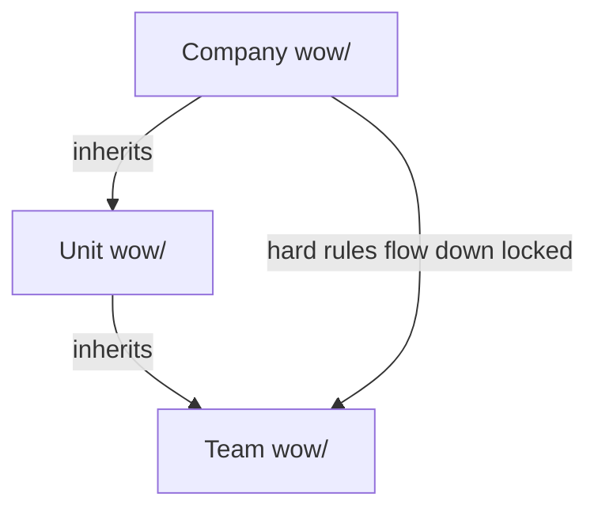

# Inheritance Model

> Part of the [wow-as-code](../README.md) specification.

## Overview

WoW-as-code supports hierarchical inheritance across organizational levels:

```
Company → Unit → Team
```

Lower levels inherit rules from higher levels and can extend or override them — with constraints.

## Hierarchy



- **Company:** Global baseline. Security, compliance, universal standards.
- **Unit:** Organizational unit (group of teams). Domain-specific practices.
- **Team:** Individual team. Day-to-day working agreements.

## Override Rules

### Mixed Override Model

| Parent enforcement | Child can... |
|---|---|
| `hard` | ❌ Cannot relax. Cannot change to `soft` or `info`. Can only ADD fields. |
| `soft` | ✅ Can tighten to `hard`. Can override any field. Can relax to `info`. |
| `info` | ✅ Can override freely. |

**Rationale:** `hard` rules represent governance/compliance constraints (e.g., "all PRs need security review"). These flow down the hierarchy untouched, giving security and compliance teams confidence. `soft` and `info` rules respect team autonomy.

### Merge Semantics

When the same `id` exists at multiple levels, fields are **merged**:

1. Start with the highest-level (company) file as the base.
2. Apply unit-level fields on top (unit wins on conflict).
3. Apply team-level fields on top (team wins on conflict).
4. **Exception:** If a higher-level file has `enforcement: hard`, the `enforcement` field is locked and cannot be overridden.

**Example:**

```yaml
# company/wow/code-review.md frontmatter
id: code-review
enforcement: soft
min_approvals: 1

# unit/wow/code-review.md frontmatter
id: code-review
min_approvals: 2           # overrides company

# team/wow/code-review.md frontmatter
id: code-review
require_perf_review: true  # adds new field

# RESOLVED:
id: code-review
enforcement: soft          # from company
min_approvals: 2           # from unit (overrides company)
require_perf_review: true  # from team (added)
```

## Discovery via config.yaml

Each level's `config.yaml` declares its parent:

```yaml
inherits_from:
  - url: "https://github.com/org/company-wow/wow"
    ref: "v1.0"
```

- `url`: Git-native URL pointing to the parent's `wow/` directory.
- `ref`: A tag (recommended for stability) or branch name.

The validator CLI resolves the full chain by following `inherits_from` references upward.

## Provenance

When displaying resolved rules, tooling MUST show provenance — which level each field originated from:

```
# code-review (resolved for team-checkout)
enforcement: soft          ← from: company
min_approvals: 2           ← from: unit-platform (overrides company: 1)
require_perf_review: true  ← from: team-checkout (added)
```

## Conflict Detection

If a team file attempts to relax a `hard` rule, `wow validate` MUST:

1. **Fail validation** with a clear error.
2. **Explain the conflict** — which higher-level file locks the rule.
3. **Suggest resolution** — "Remove the override or contact @owner."

```
❌ CONFLICT: team-checkout/code-review.md sets enforcement: soft
   but company/security-review.md locks enforcement: hard
   → Team cannot relax this rule. Remove the override or contact @security-team.
```
